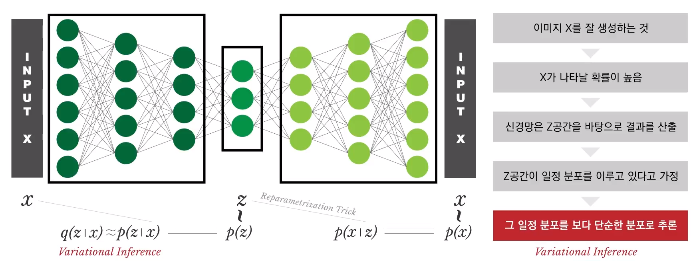
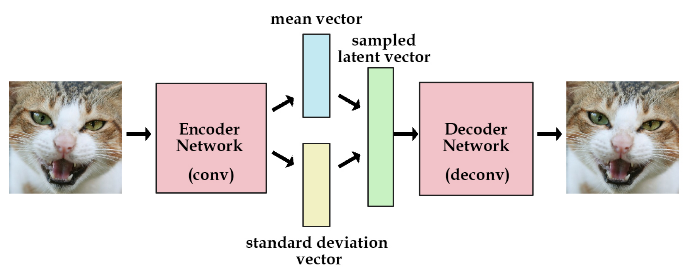
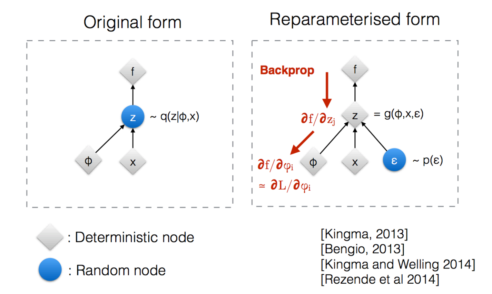

# Variational Autoencoder
## Papers:
- [The original Paper of VAE (Variational Autoencoder)](https://arxiv.org/abs/1312.6114).
- [Tutorial on Variational Autoencoder](https://arxiv.org/pdf/1906.02691.pdf) provides much more detailed explanation of VAE.

Motivation: Generating high dimensional data such as (1)Random faces (2)Speech (3)Text ....

## Definition
- **Variational Inference**을 오토 인코더 구조를 통해 구현한 신경망.
- **Variational Inference** : General family of methods for **approximating** complicated densities by a simpler class of densities.
- **Variational Inference** : Approximate q(z|x) ~= p(z|x) ,where p is much simpler than q.

Why Variational Inference?
<p align="center"></p>
- Problem : p(z|x) cannot be calculated.
- Solution : Variational Inference, p ~= q.

## Brief Summary


## Autoencoder의 구조는 동일
**"The mathematical basis of VAEs actually has relatively little to do with classical autoencoders."**

VAE : Autoencoder에서 더 나아가, Latent vector Z가 다루기 쉬운 "확률 분포"를 띄게 만들자!

The main difference between VAE and AE is a constraint on the encoding network that forces it to generate latent vectors that roughly follow **a standard unit Gaussian distribution**.

VAE is an autoencoder whose encodings distribution is regularised during the training in order to ensure that its latent space has good properties allowing us to generate some new data. Moreover, the term “variational” comes from the close relation there is between the regularisation and the variational inference method in statistics.

- Manifold Hypothesis : Given high dimensional vectoc X, data is concentrated around a low dimensional manifold -> Hope finding a representation Z of that manifold. (dimension(X) > dimension(Z))
- Intuition in the neural network perspective, VAE is just **stochastic autoencoder + regularization using prior**!
- The main idea of VAE compared to AE is **regularization prior**.
- p(z) is usually a simple prior N(0,1)


Encoder : Wish to learn θ from the N training observation {X_1, X_2, ... , X_N}
- Given a set of N-observations {X_1, X_2, ... , X_N}(e.g. images)
- Comlex model parameterized with θ
- There is a latents space with z ~ p(z) which is 'Multivariate Gaussian'.
- x|z ~ p_θ(x|z)

Encoder = Posterior = Inference Network (Gaussian)

Decoder
- Want to complex model of distribution of x given z
- Idea : NN + Gaussian (or Bernoulli) here with diagonal covariance.

Decoder = Generator = Generation Network (Bernoulli)

Learning the parameters φ and θ via backpropagation
Max-Likelihood, tune Φ, θ to maximize the likelihood


The framework of *Variational Autoencoders*(VAEs) provides a principled method for jointly learning
- deep latent-variable models 
- corresponding inference models using stochastic gradient descent

## Loss
VAEs allow us to formalize this problem in the framework of probabilistic graphical models where we are maximizing a lower bound on the log likelihood of the data.

For our loss term, we sum up two separate losses:
- Generative Loss : mean squared error that measures how accurately the network reconstructed the images
- Latent Loss : KL divergence that measures how closely the latent variables match a unit gaussian
```python
generation_loss = F.mse(generated_image, real_image)
latent_loss = KL_Divergence(latent_variable, unit_gaussian)
loss = generation_loss + latent_loss
```

## Reparameterization
Problem : Backpropagation not possible through random sampling! 
<p align="center"></p>
<p align="center"></p>
```python
def reparameterize(self, mu, log_var):
    std = torch.exp(log_var / 2)
    eps = torch.randn_like(std)
    z = mu + eps * std
    return z
```

## Comparison between VAE vs GAN
VAE
- Optimization : Stochastic Gradient Descent / Converge local minimum / Easy to train
- Image Quality : Smooth / Blurry 
- Generalization : Tend to remember input images

GAN
- Optimization : Alternating stochastic gradient descent / Converge to saddle points / Hard to train
- Image Quality : Sharp / Artifact
- Generalization : Generate new unseen images 


## Applications
Generative models are a rapidly advancing area of research. As we continue to advance these models and scale up the training and the datasets, we can expect to eventually generate samples that depict entirely plausible images or videos. This may by itself find use in multiple applications, such as on-demand generated art, or Photoshop++ commands such as “make my smile wider”. Additional presently known applications include image denoising, inpainting, super-resolution, structured prediction, exploration in reinforcement learning, and neural network pretraining in cases where labeled data is expensive.

However, the deeper promise of this work is that, in the process of training generative models, we will endow the computer with an understanding of the world and what it is made up of.

# Referenes
- [Tutorial on Variational Autoencoder](https://arxiv.org/pdf/1906.02691.pdf)
- [오토인코더의 모든 것](https://www.slideshare.net/NaverEngineering/ss-96581209)
- [Towards a Deeper Understanding of Variational Autoencoding Models](https://arxiv.org/pdf/1702.08658.pdf)
- 
